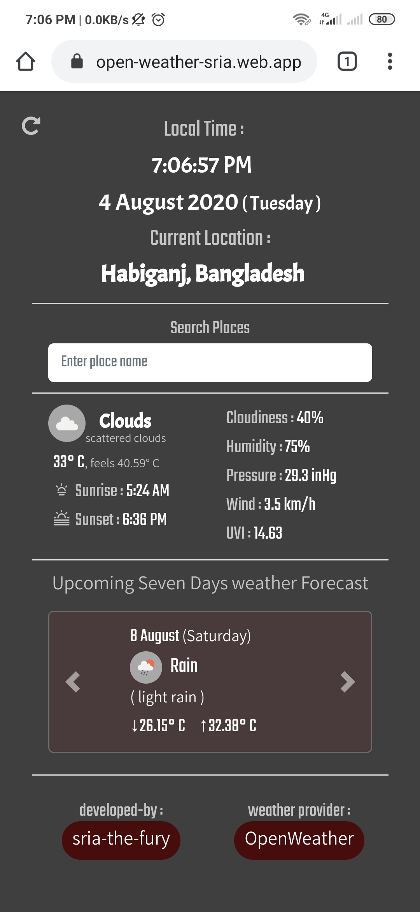
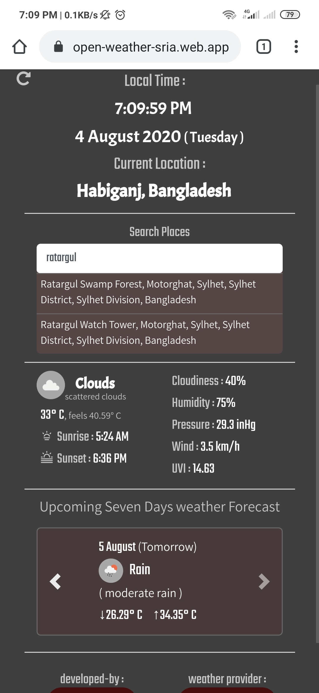
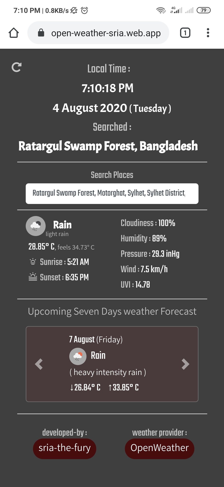

# open-weather-sria
A personal small project. A Little bit curiosity how the openWeatherMap API works. 

## **Using :**
- HTML5,CSS, Bootstrap and pure JavaScript.
- automatic geolocation by device GPS.
- **Locationiq** API for Reverse geocoding and Forward geocoding.
- **OpenWeatherMap** API for getting weather info of a specific area by latitude and longitude.

## **Features:**
- Automatically get current location by device GPS.
- More weather details.
- Upcoming seven days weather forecast.
- Search by place name.
- Search shows suggestions.
- Good design ( fully designed by the author ).

## **Hosting**
Use firebase hosting for demonstrate or viewing this web app.
It is showed better in the mobile version.
See Here : [OpenWeatherAppBySRIA](https://open-weather-sria.web.app)

**See the Interfaces :** 
 First look after acquiring geolocation access

  Second look after searching places

  Third look after selecting the searched place

## **Cons :**
- API call limitation is low per second.
- Search should be more optimized with the design.
- This should be built on ReactJS.

So, It will be coming on ReactJS.

